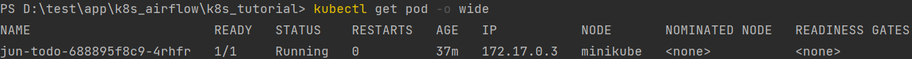
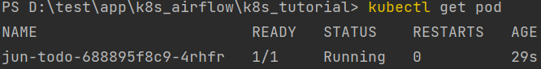

# K8s Tutorial

## Create a cluster
- Step1: Checking version after installing `kubectl` and `minikube` 
    ```commandline
    $> minikube version
    $> kubectl version
    ```

- Step2: [Minikube start a cluster using docker driver](https://minikube.sigs.k8s.io/docs/drivers/docker/)
  ```cmd
  # we need 4g memory for airflow
  $> minikube start --driver=docker --memory='4g' --kubernetes-version=v1.23.1
  # Optional
  $> minikube ip
  $> minikube status
  $> minikube ssh # login into minikube
  ```
- Step3: Check Cluster Detail
```commandline
$> kubectl cluster-info
$> kubectl get nodes
```


## Deploying an App
- Step1: Test our app
    ```commandline
    # run our image
    docker build -t hongjunyan/todo-pod:v1
    
    # hit http://localhost:3030 and you will see a todo-website
    
    # remove container
    docker rm -f test-todo
    ```

- Step2: Create deployment
1. searched for a suitable node where an instance of the application could be run (we have only 1 available node)
2. scheduled the application to run on that Node
3. configured the cluster to reschedule the instance on a new Node when needed
4. deployment usage: ``deployment <name> --image=<image location>``
```commandline
$> kubectl create deployment jun-todo --image=hongjunyan/todo-pod:v1
$> kubectl get deployments
```

## Explore our app
- Method1: Login into master node and direct access the pod.
    
    ```commandline
    $> minikube ssh
    $> curl 172.17.0.3:3000
    ```

- Method2: Using port-forward `port-forward <host_ip>:<container_ip>`
    ```commandline
    $> kubectl port-forward jun-todo-688895f8c9-4rhfr 3030:3000
    # then, open browser and hit http://localhost:3030
    ```

- Method3: Using Service
  - [Service Overview](https://godleon.github.io/blog/Kubernetes/k8s-Service-Overview/)
  - [A Tutorial about K8s](https://cwhu.medium.com/kubernetes-implement-ingress-deployment-tutorial-7431c5f96c3e)
  ```commandline
  $> kubectl create -f todoapp_service.yaml
  ```
192.168.49.2  3001:30300
10.106.57.59

- Method4: use proxy
```commandline
# open a second terminal window to run the proxy
$> kubectl proxy
```
then, get pod name with the following command:

To see the oputput of our app, run a `curl` request.
```commandline
curl http://localhost:8001/api/v1/namespaces/default/pods/jun-todo-688895f8c9-4rhfr
```